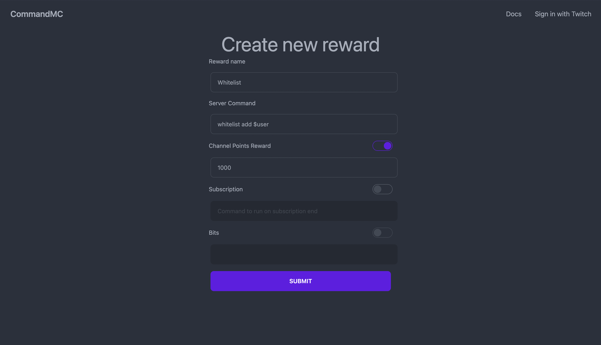

# Run a command on channel point redemption

Upon landing on the page, you'll be greeted with a few options to create your very own reward.

The page will be populated with a set example (whitelist), but you'll be able to customize this to your hearts content.

By default, the `Channel Points Reward` option is enabled. This will create a brand new redemption reward on your channel. The reward name, server command, and cost for channel point reward is all mandatory with this selected.

After pressing `Submit`, if the reward is present in the page you're redirected to then it has been successfully created. Enjoy!

<figure><figcaption>
Creating your first reward
</figcaption></figure>
